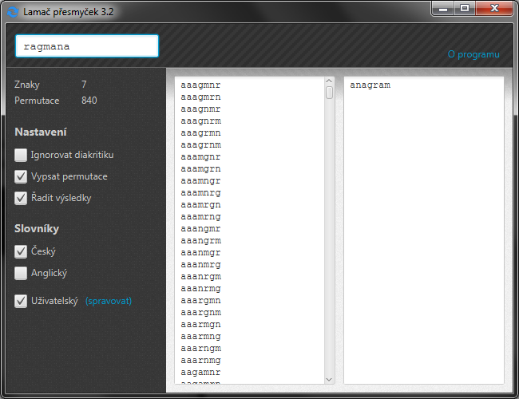

# Lamač přesmyček

*English localization is not available.*

## O programu
Lamač přesmyček je jednoduchý, snadno ovladatelný program napsaný v Javě. Neinstaluje se a v počítači nezanechává žádné soubory.

## Použití
Přesmyčka se napíše do textového pole a po stisku klávesy enter dojde k jejímu vyřešení. Vyřešení by mělo být prakticky okamžité. 

Délka přesmyčky není nijak omezena. Na velikosti písmen nezáleží.

Pokud nebude nalezeno žádné odpovídající slovo, stále je možnost ho najít ručně ve výpisu permutací. Výpis permutací je možné provést až do délky 10 znaků nebo 25 000 permutací.

## Slovníky
### Vestavěné
- český – 1 070 713 slov
- anglický – 632 184 slov (včetně slov s apostrofem)

### Uživatelské
Uživatel má možnost přidat vlastní slovníky. 

Mohou být přidány pouze textové soubory s kódováním UTF-8, na příponě souboru nezáleží. Každý řádek představuje jeden záznam. Jediná prováděná úprava je oříznutí každého řádku od bílých znaků. Na velikosti znaků opět nezáleží.

## Dodatečné informace
- Spustitelné java archivy je možné stáhnou v kartě *releases*.
- Ke spuštění je vyžadovaná **Java 8**.
